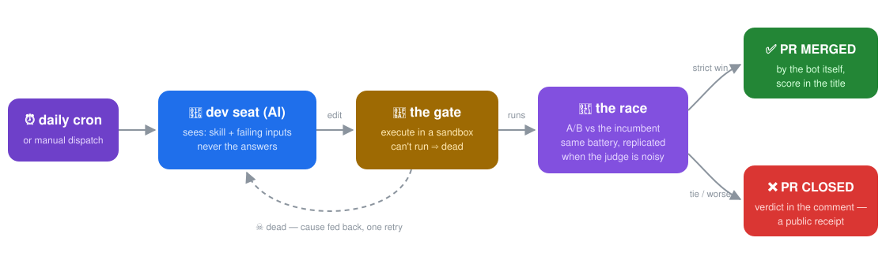

# 🌑🏭 dark-factory

> **A repository that improves its own contents — and only merges a change it
> can prove made things better.**

Once a day, a GitHub Action asks an AI to improve one of the skills in this
repo. The proposal is executed in a sandbox, then raced head-to-head against
the current version on a fixed test battery. **A strict win merges itself.
Anything else becomes a closed PR with the score in the comment.** No human in
the loop, and no vibes either: `main` only moves on a measured, controlled win.

It has already happened — see [the receipts](#-receipts).

---

## Contents

- [What it is](#-what-it-is)
- [How the loop works](#-how-the-loop-works)
- [Install](#-install)
- [Use it](#-use-it)
- [Fork it / hack it](#-fork-it--hack-it)
- [Repo layout](#-repo-layout)
- [Guardrails](#-guardrails)
- [Receipts](#-receipts)
- [Design notes (optional)](#-design-notes-optional)

---

## 🔍 What it is

The repo contains **skills**: small artifacts, each a single markdown document
in [`garage/`](garage/). A skill is one of two kinds:

| kind | what the artifact is | who executes it |
|---|---|---|
| **`code`** | a doc with a fenced ` ```python ` block defining `solve(text) -> str` | a sandboxed interpreter (deterministic) |
| **`prose`** | pure written instructions, no code | a **fresh AI session per test case**, following the document literally |

Each skill has a **battery**: a fixed list of inputs with known-correct
outputs. Fitness = how many it gets right. The battery belongs to the factory,
not the skill — *a thing can't grade itself.*

The **factory** is the scheduled process that evolves the skills. The AI that
proposes changes (the *dev seat*) is deliberately weak-by-construction: a
toolless HTTP call that sees only the current document and the inputs it
fails — **never the expected outputs**. It can be wrong, confidently wrong,
even adversarially wrong. The selection structure is what's sound.

## ⚙️ How the loop works

<p align="center">
  
</p>

1. **Propose** — the dev seat gets the skill + its failing inputs and returns
   an edited document.
2. **Gate** — the candidate is executed for real in quarantine. Syntax error,
   crash, timeout ⇒ dead on arrival; the cause goes back to the seat for one
   retry.
3. **Race** — survivor vs incumbent on the identical battery. `code` skills
   race once (the judge is deterministic). `prose` skills race **3 replicates,
   strict majority** — fresh AI judges are noisy, and a lucky single race can
   lie in both directions.
4. **Verdict = merge.** Strictly more correct outputs ⇒ the Action merges its
   own PR. Tie or worse ⇒ the PR is closed as a public receipt. A skill at max
   score is marked `SATURATED` and skipped until its battery grows.

## 📦 Install

Requires **Python ≥ 3.10**.

```bash
git clone https://github.com/sancovp/dark-factory
cd dark-factory
pip install -r requirements.txt
```

That's everything for the machinery. The AI seats additionally need one
environment variable:

| env var | required for | default |
|---|---|---|
| `MINIMAX_API_KEY` | the dev seat + the prose judge | — (without it, cycles skip; the selftest still runs) |
| `MINIMAX_BASE_URL` | pointing at a different Anthropic-compatible endpoint | `https://api.minimax.io/anthropic/v1/messages` |
| `FACTORY_MODEL` | choosing the model | `MiniMax-M2.7-highspeed` |
| `FACTORY_REPLICATES` | prose-race replicate count | `3` |

## ▶️ Use it

```bash
# prove the gate/race machinery on fixtures — no API key needed
python -m factory.run_cycle --selftest

# run one real factory cycle over every skill, locally
MINIMAX_API_KEY=… python -m factory.run_cycle

# just one skill
MINIMAX_API_KEY=… python -m factory.run_cycle --car extract-emails
```

Locally, a `SHIP` writes the winning artifact into `garage/` and appends to
[`LINEAGE.json`](LINEAGE.json). In CI (`--ci`, used by
[the workflow](.github/workflows/factory.yml)), every proposal becomes a real
PR that the bot merges or closes.

**Pause the factory:** delete the `FACTORY_ON` file (restore it to resume).
**Change the schedule:** edit the `cron:` line in
[`factory.yml`](.github/workflows/factory.yml).
**Read the history:** `LINEAGE.json` (machine-readable), or just the PR list —
merged `[SHIP]` PRs are proven improvements; closed PRs are the graveyard.

## 🔧 Fork it / hack it

Your own self-developing repo in four steps:

1. **Fork**, then add a skill directory:

   ```
   garage/my-skill/
   ├── skill.md        # the artifact under evolution
   ├── battery.json    # the test battery
   └── car.json        # {"name": "my-skill", "kind": "code", "generation": 0}
   ```

2. **Write `skill.md`.** For a `code` skill it must contain one fenced python
   block defining `solve`:

   ````markdown
   # Skill: my-skill
   One line about what it does.

   ```python
   def solve(text):
       return text.upper()      # input arrives as a string; return a string
   ```
   ````

   For a `prose` skill (`"kind": "prose"`), the whole document is the program —
   a fresh AI session receives it plus one input and follows it literally.

3. **Write `battery.json`** — the track your skill races on. Exact string
   match, whitespace-stripped:

   ```json
   [
     {"input": "hello", "expected": "HELLO"},
     {"input": "ok",    "expected": "OK"}
   ]
   ```

   Seed the skill with headroom (a known weakness) if you want to watch the
   factory find the fix — or ship it perfect and watch it get marked
   `SATURATED` on cycle one.

4. **Add the `MINIMAX_API_KEY` secret** to your fork's Actions
   (*Settings → Secrets and variables → Actions*), and allow Actions to create
   PRs (*Settings → Actions → General → "Allow GitHub Actions to create and
   approve pull requests"*). Done — the daily cron does the rest, or trigger a
   cycle now from the Actions tab (`workflow_dispatch`).

Hack targets, in rising ambition: swap the endpoint (`MINIMAX_BASE_URL` — any
Anthropic-compatible API works); tighten or grow a battery (growing a battery
un-saturates a skill); change the replicate count; add a new judge type in
[`factory/seats.py`](factory/seats.py); or replace the whole car concept via
[`cave-teams`](https://github.com/sancovp/cave-teams)' `CarKind` — the factory
is generic over what it evolves.

## 🗺 Repo layout

| path | what |
|---|---|
| [`garage/`](garage/) | the skills under evolution (artifact + battery + generation counter each) |
| [`LINEAGE.json`](LINEAGE.json) | every verdict, death, score, and saturation — machine-readable history |
| [`factory/run_cycle.py`](factory/run_cycle.py) | the runner: gate, race, PR mechanics, path guard |
| [`factory/seats.py`](factory/seats.py) | the two AI seats — plain HTTP calls, no agent framework |
| [`.github/workflows/factory.yml`](.github/workflows/factory.yml) | daily cron + manual dispatch + selftest on PRs |
| [`tests/fixtures.json`](tests/fixtures.json) | self-contained selftest world (known-buggy / known-broken / known-better + battery) |
| `FACTORY_ON` | the kill switch — delete to pause autonomous cycles |

## 🛡 Guardrails

- **Path-guarded runner.** The factory can write `garage/` and `LINEAGE.json`,
  nothing else. It cannot edit its own code, the workflow, or this README — no
  self-modifying CI.
- **Toolless seats.** The AI seats see exactly what the prompt contains and
  return text. They cannot browse the repo — which matters, because the
  batteries are public here. The claim is about the selection structure, not
  about trusting the model.
- **Answers never leak.** The dev seat is shown failing *inputs* only.
- **Ties never ship.** Change has cost; correlation and coin-flips don't merge.
- **Keyless selftest on every PR** proves the gate/race machinery on fixtures,
  independent of the live skills' state.

## 🧾 Receipts

From the repo's **first unattended run**:

| PR | result | what happened |
|---|---|---|
| [#1](../../pull/1) `[SHIP] extract-emails gen1: 4→6` | **merged by the bot** | the seeded skill had a case-sensitivity bug (4/6); the AI saw two failing inputs, wrote the fix (`re.IGNORECASE` + normalize), survived the gate, won 6–4 |
| [#2](../../pull/2) `[REVERT] … 3.0→3.0` | **closed by the bot** | a plausible prose rewrite passed the gate but tied its race, 0 wins in 3 replicates |

And the failure mode this design exists for, observed live: in one run the dev
seat read a *bug* as *intent* and rewrote it to be **more rigorously wrong**,
with a confident justification. It passed the sandbox. The race measured it
losing, and the PR closed. You don't need the proposer to be right — you need
the selection structure to be sound.

## 📐 Design notes (optional)

Internally the artifact is called the **car**, after a claim about Formula 1:
the sport isn't about the drivers or the pit crew — everything is an effect of
the car's fitness. The escalation ladder here is:

```
market opinion → directed R&D → controlled trial (A/B) → replicated trials
```

Each rung makes it strictly harder for a bad change to survive. The
constructors (`Formula1Stable` = propose+gate loop, `Racetrack` = the A/B
split, `Championship` = replicated splits) live in
[`cave-teams`](https://github.com/sancovp/cave-teams) as ordinary composable
objects. For the mathematically inclined: the "improve the improver" tower
they form is the function-space tower `D_{n+1} = [D_n → D_n]`, whose limit is
Scott's `D∞ ≅ [D∞ → D∞]`; a finite, exhaustively-tested proof-object for that
construction lives in [`sancovp/lfpoop`](https://github.com/sancovp/lfpoop)
(`lfpoop/dinfinity.py`). None of it is needed to use the factory.

**License:** MIT.
